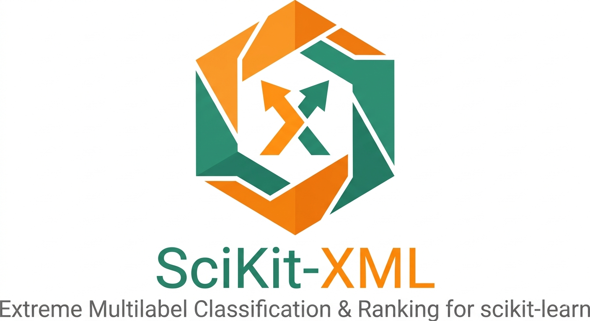

# SciKit-XML

Advanced evaluation metrics for extreme multilabel classification and ranking tasks in scikit-learn.

## Overview

SciKit-XML is a Python package that provides a comprehensive set of evaluation metrics for machine learning models, with a focus on extreme multilabel classification and ranking scenarios. It extends scikit-learn with specialized metrics that go beyond standard classification metrics.

The package includes metrics such as Precision@k, Recall@k, Mean Average Precision (MAP@k), and Normalized Cumulative Discount Gain (NDCG@k), along with propensity-scored variants to handle biased datasets.

## Features

- **Ranking Metrics**: Precision@k, Recall@k, MAP@k, and NDCG@k for evaluating top-k predictions
- **Propensity-Scored Variants**: Bias-corrected versions of all metrics for handling imbalanced and biased datasets
- **Scikit-Learn Integration**: Compatible scorers for use with scikit-learn's model selection and evaluation tools
- **Efficient Computation**: Optimized implementations using NumPy and Numba for fast metric calculation
- **Input Validation**: Comprehensive validation utilities to ensure data compatibility

## Requirements

- Python 3.10 or newer
- NumPy >= 1.23.4
- SciPy >= 1.8.0
- Pandas >= 1.4.1
- scikit-learn >= 1.3.2
- Joblib >= 1.3.2
- Numba >= 0.59.0

## Installation

Install the package using pip:

```bash
pip install skxml
```

Or, to install from source:

```bash
git clone https://github.com/CarloNicolini/scikit-xml.git
cd scikit-xml
pip install -e .
```

## Quick Start

### Basic Usage

Here's a simple example of computing Precision@k:

```python
import numpy as np
from skxml import precision_at_k

# Ground truth labels (binary matrix)
y_true = np.array([[1, 0, 1], [0, 1, 1]])

# Predicted scores
y_pred = np.array([[0.8, 0.2, 0.4], [0.1, 0.6, 0.8]])

# Compute Precision@2
precision = precision_at_k(y_true, y_pred, k=2)
print(f"Precision@2: {precision}")
```

### Using with Scikit-Learn

The package provides scorers compatible with scikit-learn's model selection tools:

```python
from sklearn.model_selection import cross_validate
from skxml import precision_at_k_scorer

# Use with cross-validation
scores = cross_validate(
    model, X, y,
    scoring={'precision@5': precision_at_k_scorer(k=5)}
)
```

### Available Metrics

- `precision_at_k`: Precision at top-k predictions
- `recall_at_k`: Recall at top-k predictions
- `map_at_k`: Mean Average Precision at top-k
- `ndcg_at_k`: Normalized Cumulative Discount Gain at top-k
- `psprecision_at_k_scorer`: Propensity-scored Precision@k
- `psrecall_at_k_scorer`: Propensity-scored Recall@k
- `psf1_at_k_scorer`: Propensity-scored F1@k

## Documentation

For detailed documentation and API reference, see the docstrings in the source code.

## Contributing

Contributions are welcome! Please feel free to submit issues or pull requests to improve the package.

## License

This project is licensed under the MIT License. See the [LICENSE](LICENSE) file for details.
